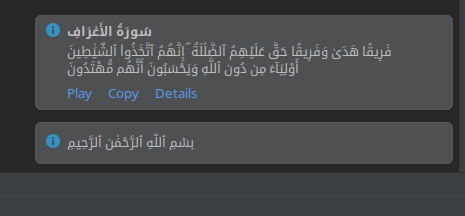
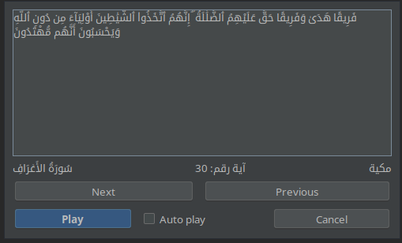
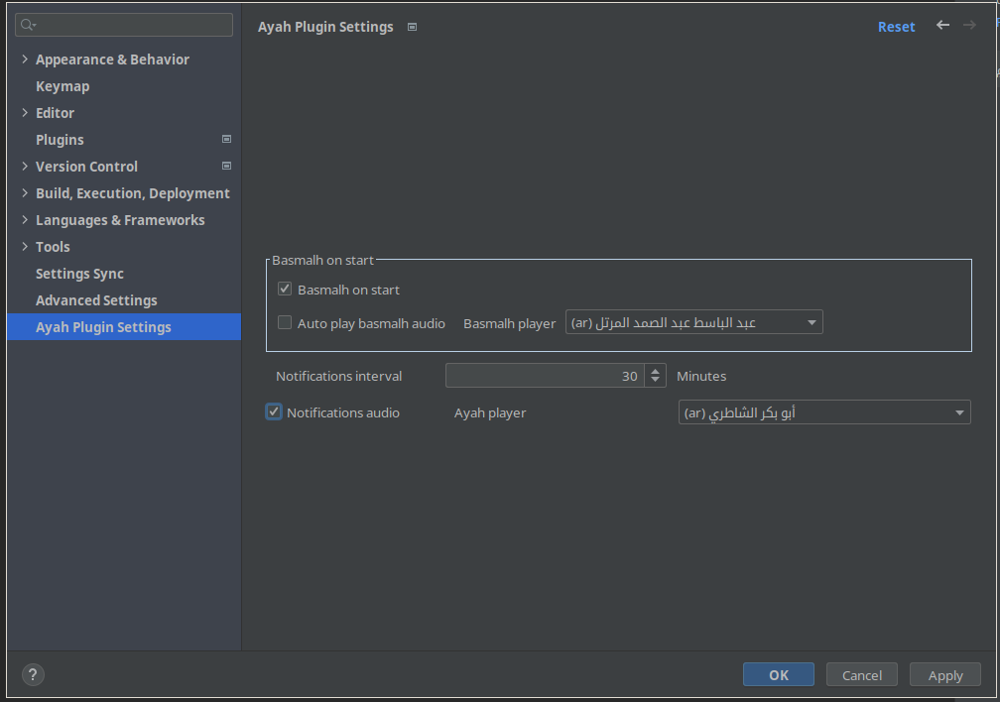

<!-- Plugin description -->

    

### Get a verse(an ayah) from the Quran during your coding session 💻 stay connected with the words of Allah. 🤍

### Features
- Get a verse from the Quran during your coding session 
- Get the basmlah after open project
- Copy the ayah to clipboard.
- Read the ayah in different languages and different voices.
- Show the ayah details if you want.
- Very Customizable
<!-- Plugin description end -->

Inspired by Ayat on vscode by Hussam Adil.

